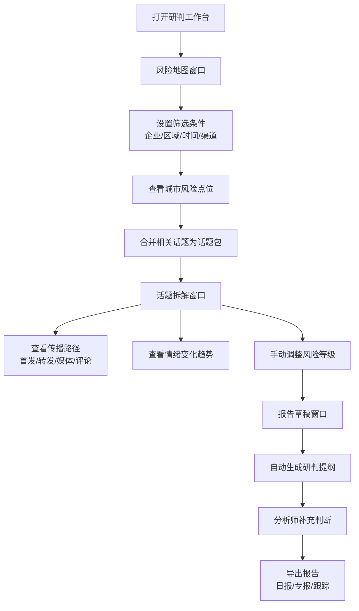

## 1. 产品概述

面向舆情分析师的桌面端研判工作台，围绕涉企舆情风险地图提供专业分析能力而非简单告警。工作台采用三窗口联动设计，支持从风险发现→话题拆解→报告生成的完整研判流程，强调可核验、可编辑、可复盘。

- 目标用户：第三方舆情公司分析师、企业公关团队、政府舆情监测人员
- 核心价值：从海量舆情中提炼专业研判结论，提升日报、专报、突发事件跟踪的产出质量和效率

## 2. 核心功能

### 2.1 用户角色

| 角色 | 使用场景 | 核心需求 |
|------|---------|---------|
| 舆情分析师 | 日常舆情监测、事件深度研判、报告撰写 | 快速定位风险、多维分析传播、高效输出报告 |
| 团队主管 | 报告审核、质量把控 | 研判依据可追溯、风险等级可调、报告模板规范 |

### 2.2 功能模块

1. **风险地图窗口**：多维度筛选、城市风险点位热力图、话题合并
2. **话题拆解窗口**：传播路径分析、关键节点识别、情绪变化追踪、风险等级调整
3. **报告草稿窗口**：研判提纲自动生成、内容编辑、导出功能

### 2.3 页面详情

| 窗口名称 | 模块名称 | 功能描述 |
|---------|---------|---------|
| 风险地图窗口 | 筛选面板 | 企业选择、区域选择、时间段选择、传播渠道选择 |
| 风险地图窗口 | 地图展示 | 按城市显示风险点位、热力分布、点击查看详情 |
| 风险地图窗口 | 话题列表 | 同一事件不同说法合并为话题包、话题排序、话题筛选 |
| 话题拆解窗口 | 传播路径 | 最早发帖账号、关键转发节点、媒体跟进时间线 |
| 话题拆解窗口 | 情绪分析 | 评论情绪变化曲线、正负中性占比、典型评论 |
| 话题拆解窗口 | 风险研判 | 手动调整风险等级、研判依据记录、风险标签标注 |
| 报告草稿窗口 | 提纲生成 | 自动带出事件概况、涉事地区、影响人群、回应口径、观察项 |
| 报告草稿窗口 | 编辑面板 | 富文本编辑、补充判断、调整结构 |
| 报告草稿窗口 | 导出功能 | 导出为 Word/PDF、保存草稿、历史版本 |

## 3. 核心流程

分析师在风险地图中通过企业、区域、时间段和传播渠道筛选，系统按城市展示风险点位。分析师将同一事件的不同说法合并成话题包后，进入话题拆解窗口查看传播路径、关键节点和情绪变化，并手动调整风险等级避免声量误判。最后在报告草稿窗口基于自动生成的研判提纲补充判断后导出报告。

## 4. 用户界面设计

### 4.1 设计风格

- **主色调**：深蓝灰（#1a2332）作为主背景，体现专业稳重；橙红色（#e64a19）作为风险警示色
- **辅助色**：蓝色系（#1976d2）表示中性信息，绿色（#2e7d32）表示正面情绪，红色（#c62828）表示负面情绪
- **布局风格**：三窗口可拖拽布局，左侧导航切换，主内容区采用卡片式分区
- **字体**：思源黑体（Source Han Sans）作为主要字体，等宽字体用于数据展示
- **图标风格**：线性图标，简洁专业，避免过度装饰
- **整体调性**：专业数据工作台风格，深色主题，信息密度高，强调数据可读性

### 4.2 页面设计概览

| 窗口名称 | 模块名称 | UI元素 |
|---------|---------|--------|
| 风险地图窗口 | 筛选面板 | 下拉选择器、日期范围选择、渠道多选标签、筛选按钮 |
| 风险地图窗口 | 地图区域 | 中国地图底图、城市热力点、风险等级颜色编码、悬浮tooltip |
| 风险地图窗口 | 话题列表 | 话题卡片、声量柱状图、风险标签、合并操作按钮 |
| 话题拆解窗口 | 传播路径 | 时间轴布局、节点卡片、连线动画、账号头像和名称 |
| 话题拆解窗口 | 情绪分析 | 面积图、正负中性比例环、评论列表 |
| 话题拆解窗口 | 风险研判 | 等级滑块、研判依据输入框、标签选择器 |
| 报告草稿窗口 | 提纲区域 | 分段标题、自动填充内容、可编辑区块 |
| 报告草稿窗口 | 工具栏 | 保存、导出、预览、撤销/重做按钮 |

### 4.3 响应式设计

- 桌面端优先，支持 1366×768 及以上分辨率
- 三窗口布局支持拖拽调整宽度和位置
- 窗口可独立最大化/最小化
- 适配 2K/4K 高分辨率屏幕

### 4.4 数据可视化

- 地图使用 ECharts 中国地图，支持缩放和平移
- 传播路径使用关系图或桑基图
- 情绪变化使用面积图，多维度叠加
- 风险等级使用颜色编码和图标双重标识
