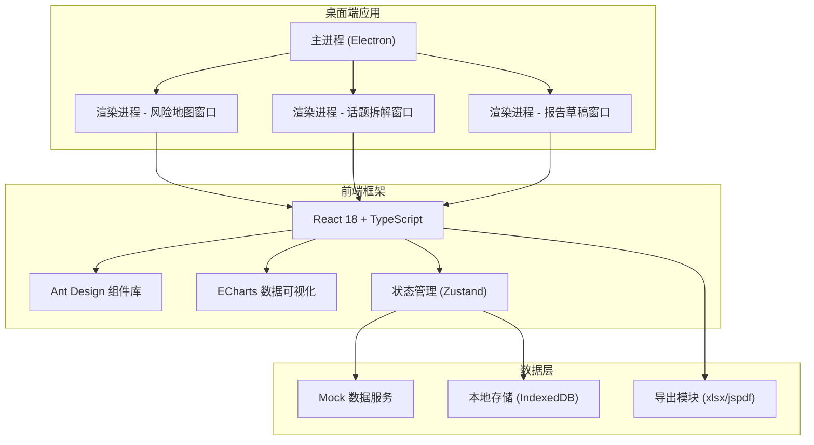
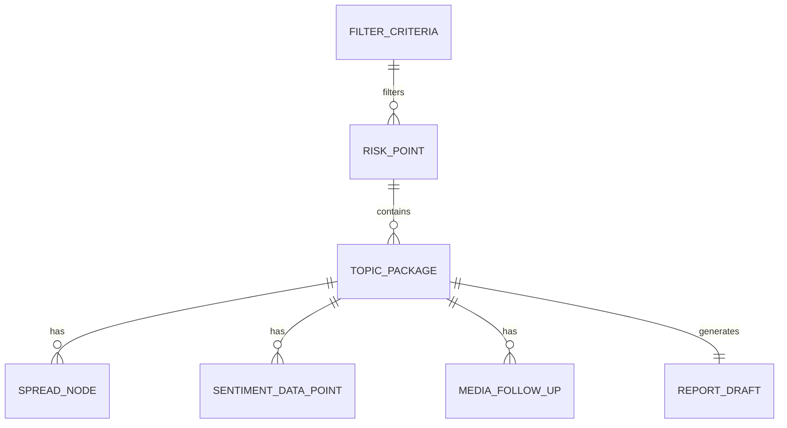

## 1. 架构设计



## 2. 技术描述

- **前端框架**：React 18 + TypeScript + Vite
- **UI 组件库**：Ant Design 5.x
- **数据可视化**：ECharts 5.x（地图、图表）
- **状态管理**：Zustand（轻量级状态管理）
- **桌面框架**：Electron（可选，首期用 Web 版本演示）
- **样式方案**：Tailwind CSS 3 + CSS Modules
- **导出功能**：xlsx（Excel）、jspdf（PDF）
- **数据存储**：Mock 数据 + localStorage/IndexedDB

## 3. 路由定义

| 路由/窗口 | 用途 |
|-----------|------|
| /map | 风险地图窗口 - 筛选与地图展示 |
| /topic/:id | 话题拆解窗口 - 传播与情绪分析 |
| /report/:id | 报告草稿窗口 - 提纲生成与编辑 |

## 4. 数据模型

### 4.1 核心数据类型

```typescript
// 风险点位
interface RiskPoint {
  id: string;
  city: string;
  province: string;
  riskLevel: 'high' | 'medium' | 'low';
  volume: number;
  topics: string[];
  coordinates: [number, number];
}

// 话题包
interface TopicPackage {
  id: string;
  title: string;
  relatedStatements: string[];
  riskLevel: 'high' | 'medium' | 'low';
  volume: number;
  sentiment: { positive: number; neutral: number; negative: number };
  firstPostTime: Date;
  latestPostTime: Date;
  channels: string[];
  cities: string[];
}

// 传播节点
interface SpreadNode {
  id: string;
  accountName: string;
  accountType: 'user' | 'media' | 'kolt' | 'official';
  followers: number;
  postTime: Date;
  content: string;
  repostCount: number;
  commentCount: number;
  likeCount: number;
  isKeyNode: boolean;
}

// 传播路径
interface SpreadPath {
  topicId: string;
  nodes: SpreadNode[];
  edges: { source: string; target: string; weight: number }[];
  timeline: MediaFollowUp[];
}

// 媒体跟进
interface MediaFollowUp {
  id: string;
  mediaName: string;
  mediaLevel: 'national' | 'provincial' | 'local' | 'industry';
  reportTime: Date;
  title: string;
  url: string;
}

// 情绪数据点
interface SentimentDataPoint {
  time: Date;
  positive: number;
  neutral: number;
  negative: number;
  total: number;
}

// 研判报告
interface ReportDraft {
  id: string;
  topicId: string;
  title: string;
  createTime: Date;
  updateTime: Date;
  eventOverview: string;
  involvedRegions: string[];
  affectedGroups: string[];
  suggestedResponse: string;
  observationItems: string[];
  analystJudgment: string;
  riskLevel: 'high' | 'medium' | 'low';
}

// 筛选条件
interface FilterCriteria {
  enterprises: string[];
  regions: string[];
  timeRange: { start: Date; end: Date };
  channels: string[];
  riskLevels: ('high' | 'medium' | 'low')[];
}
```

### 4.2 数据关系图



## 5. 目录结构

```
src/
├── components/          # 公共组件
│   ├── layout/         # 布局组件
│   ├── charts/         # 图表组件
│   └── common/         # 通用组件
├── pages/              # 页面/窗口
│   ├── RiskMap/        # 风险地图窗口
│   ├── TopicAnalysis/  # 话题拆解窗口
│   └── ReportDraft/    # 报告草稿窗口
├── store/              # 状态管理
│   ├── useFilterStore.ts
│   ├── useTopicStore.ts
│   └── useReportStore.ts
├── data/               # Mock数据
│   ├── riskPoints.ts
│   ├── topics.ts
│   ├── spreadPath.ts
│   └── sentiment.ts
├── types/              # TypeScript类型定义
│   └── index.ts
├── utils/              # 工具函数
│   ├── export.ts
│   └── format.ts
├── App.tsx
├── main.tsx
└── index.css
```

## 6. 关键技术决策

1. **单页应用模拟多窗口**：使用标签页切换 + 可拖拽面板模拟桌面多窗口体验，降低开发复杂度
2. **ECharts 中国地图**：使用 echarts-for-react 封装，支持地图缩放、点位热力、区域高亮
3. **Zustand 状态管理**：轻量级方案，支持跨窗口/组件状态共享
4. **Ant Design 5**：企业级组件库，深色主题适配专业工作台风格
5. **Mock 数据驱动**：内置丰富的模拟数据，确保离线可用和演示效果
6. **导出功能**：支持导出 Word 格式（使用 html-to-docx）和文本复制
